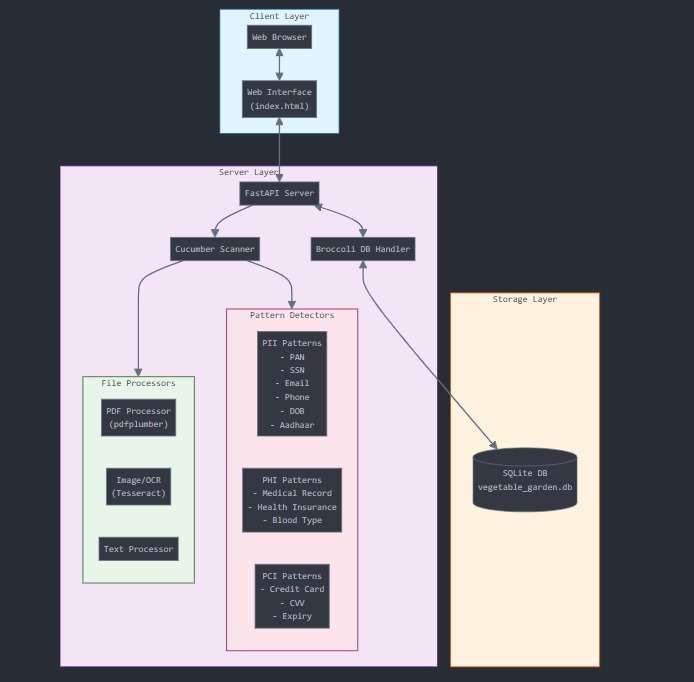
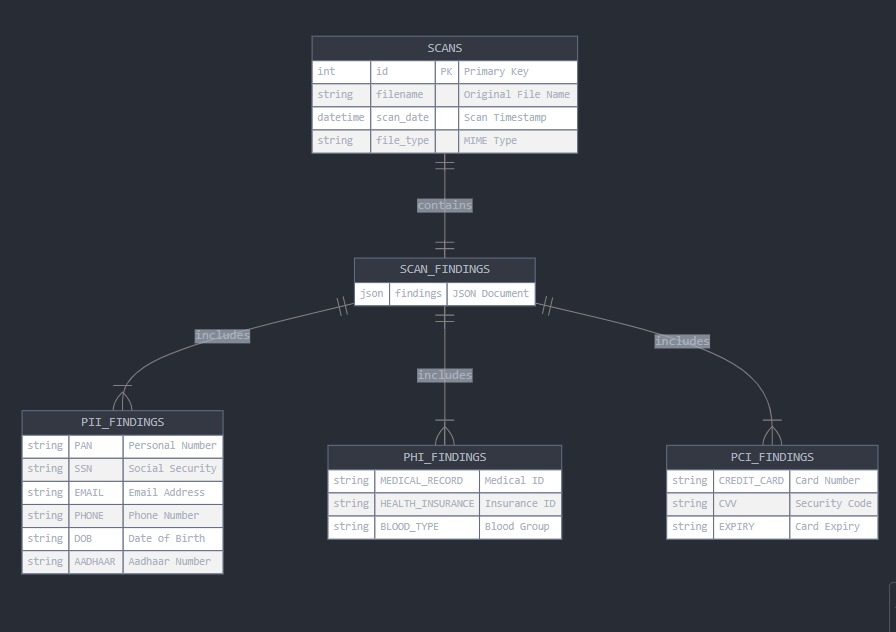

# Sensitive Data Scanner - Aurva Assignment by Siddhanth Sridhar

## 🔍 Project Overview
A sophisticated FastAPI-powered application designed to detect and analyze sensitive information across multiple file types, providing robust data protection and scanning capabilities.

## 🌟 Key Features
- Multi-format file support (PDF, images, text files)
- Advanced sensitive data pattern recognition
- Secure SQLite database storage
- Interactive web interface
- Comprehensive scan result management

## 🧩 System Architecture

### Core Components

#### 1. `Cucumber` Class (Data Scanner)
- **Functionality**: Primary scanning and text extraction mechanism
- **Key Methods**:
  - `extract_text_from_image()`: OCR-based text extraction from images
  - `extract_text_from_pdf()`: Multi-strategy PDF text extraction
  - `scan_lettuce()`: Core scanning method for detecting sensitive patterns
- **Sensitive Pattern Categories**:
  - PII (Personally Identifiable Information)
  - PHI (Protected Health Information)
  - PCI (Payment Card Information)

#### 2. `Broccoli` Class (Database Management)
- **Functionality**: SQLite database operations
- **Key Methods**:
  - `init_db()`: Database schema initialization
  - `store_spinach()`: Save scan results
  - `get_all_radish()`: Retrieve all scan records
  - `delete_celery()`: Remove specific scan records

#### 3. `Carrot` Model (Data Representation)
- **Purpose**: Structured representation of scan results
- **Attributes**:
  - `file_id`: Unique scan identifier
  - `filename`: Original file name
  - `scan_date`: Timestamp of scan
  - `findings`: Detected sensitive data patterns

### Web Application Components

#### FastAPI Endpoints
- `GET /`: Serve main web interface
- `POST /scan/`: Handle file uploads and scanning
- `GET /scans/`: Retrieve all scan records
- `DELETE /scans/{scan_id}`: Delete specific scan record

## 🛠 Technical Details

### Sensitive Data Detection Patterns

#### PII Patterns
- PAN Card Number
- Social Security Number (SSN)
- Email Addresses
- Phone Numbers
- Date of Birth
- Aadhaar Number

#### PHI Patterns
- Medical Record Numbers
- Health Insurance Identifiers
- Blood Type Identification

#### PCI Patterns
- Credit Card Numbers
- CVV Codes
- Card Expiry Dates

### Text Extraction Strategies
1. Direct text extraction
2. OCR (Optical Character Recognition) fallback
3. Multi-encoding text decoding

### File Type Detection
- Signature-based detection
- Extension-based fallback
- Supports multiple MIME types

## Diagrams

### Architecure Diagram


### Database Schema


## 🚀 Installation & Setup

### Prerequisites
- Python 3.8+
- Tesseract OCR
- System Dependencies
  
## 🖥 Running Application
Git Clone Repository
```bash
git clone https://github.com/sidd2305/Sensitive_Card_Scanner
```
Create & Activate Virtual Environment
On Windows
```bash
python -m venv venv
source venv/bin/activate
```

Modify main.py with the tesseract path on your computer/PC(in main.py)

On Linux
```bash
python -m venv venv
venv\Scripts\activate 
```
Install dependencies:
```bash
pip install -r requirements.txt
```
Run main python file
```bash
python main.py
```

Access web interface: `http://localhost:8000`


### Tesseract Installation
- Windows: Download official installer
- Linux: `sudo apt-get install tesseract-ocr`
- macOS: `brew install tesseract`

## 🔧 Configuration
- Adjust Tesseract path in `main.py`
- Customize regex patterns in `Cucumber` class
- Configure database path in `Broccoli` class


## 📋 Usage Workflow
1. Upload document via web interface
2. Automatic sensitive data scanning
3. View detected sensitive information
4. Manage scan records

## 🛡 Security Considerations
- Temporary file handling
- Secure text extraction
- Pattern-based detection
- Database isolation

## 🔬 Extensibility
- Easy addition of new sensitive data patterns
- Modular design for future enhancements
- Supports diverse file format expansion

## 🚧 Limitations
- OCR accuracy depends on document quality
- Performance varies with document complexity
- Requires local Tesseract installation

## 🔮 Future Improvements
- Cloud storage integration
- Advanced machine learning pattern recognition
- Enhanced file format support
- Comprehensive reporting
